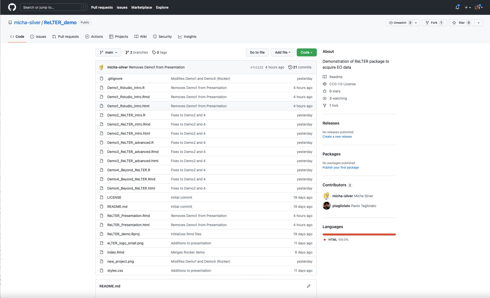
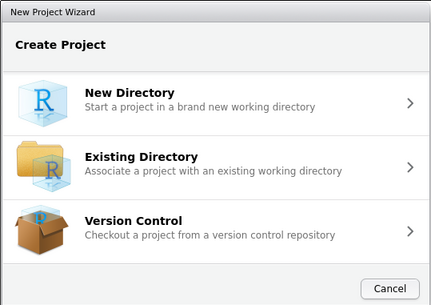

```{r setup1, include=FALSE, purl=FALSE}
knitr::opts_chunk$set(echo = TRUE)
```

## This Demo

  - Rmarkdown: cloned from https://github.com/micha-silver/ReLTER_demo
  - Slides on website: https://micha-silver.github.io/index.html
  - Youtube videos: (*to be announced*)
  
  {.cover height="375"}

## Beginning with RStudio and git

  RStudio (https://www.rstudio.com/products/rstudio/download/)

#### Start a new RStudio project **based on a git repo**.

New Project -> Version Control

{.cover width="350"}

Encourages collaboration "out of the box". https://github.com/micha-silver/ReLTER_demo

----

## Some `R` online resources
 
 - `R` for Data Science: https://r4ds.had.co.nz
 - FasteR: https://github.com/matloff/fasteR
 - Rseek: https://rseek.org/


## Where to get `R` packages
 
 - CRAN: https://cran.r-project.org/
 - BioConductor: https://www.bioconductor.org/install/
 - GitHub packages repository (i.e. [`ReLTER`](https://docs.ropensci.org/ReLTER/index.html)
 
{.cover height="375"}
 
----

#### Installing packages from standard repositories

```{r intro-packages, message=FALSE}
# Install some standard spatial packages from CRAN
if (!require("sf", quietly = TRUE))
  install.packages("sf")
if (!require("terra", quietly = TRUE))
  install.packages("terra")

# package from Bioconductor
if (!require("BiocManager", quietly = TRUE))
  install.packages("BiocManager")
BiocManager::install()
BiocManager::install("EBImage")
```


#### Installing from github

```{r install-remotes, message=FALSE}
# Install development package from github
if (!require("remotes", quietly = TRUE))
  install.packages("remotes")
```

```{r install-ReLTER, message=FALSE}
# Install the dev version of ReLTER for use new function
if (!require("ReLTER", quietly = TRUE))
  remotes::install_github("ropensci/ReLTER", ref = 'dev__withImprovements')

## ReLTER is specially drafted for the LTER community.
## 
## To contribute to the improvement of this package, join the group of
##     developers (https://github.com/ropensci/ReLTER).
## 
## If you use this package, please cite as:
## 
## Alessandro Oggioni, Micha Silver, Luigi Ranghetti & Paolo Tagliolato.
##     (2021) oggioniale/ReLTER: ReLTER v1.1.0 (1.1.0). Zenodo.
##     https://doi.org/10.5281/zenodo.5576813
```


## Loading packages

After installing, we need to load the packages into this `R` session.

```{r intro-loading, message=FALSE, warning=FALSE}
# Convenient way to load list of packages
pkg_list <- c("sf", "terra", "ReLTER", "tmap")
lapply(pkg_list, require, character.only = TRUE)
```


## `R` Spatial

#### Key packages

  - Handling vector data: `sf`, `terra`
  - Handling raster data: `terra`, `stars`
  - Visualization: `tmap`, `leaflet`, `ggmap`, (`plot`)
  - Old, deprecated packages: ~~sp~~, ~~rgdal~~, ~~raster~~, ~~rgeos~~

#### Online resources

  - Geocomputation with R: https://geocompr.robinlovelace.net/
  - Spatial Data Science: https://www.rspatial.org/
  - A blog on R-spatial issues: https://r-spatial.org/
  - Packages are maintained here: https://github.com/rspatial

----
