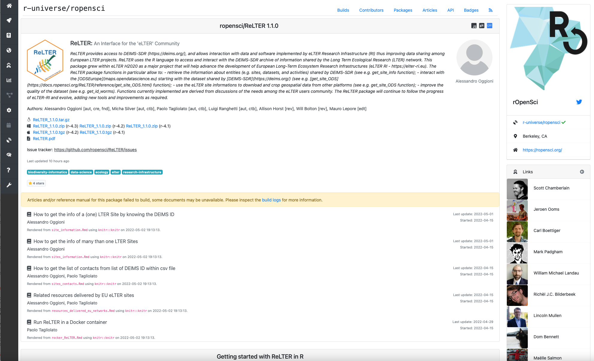
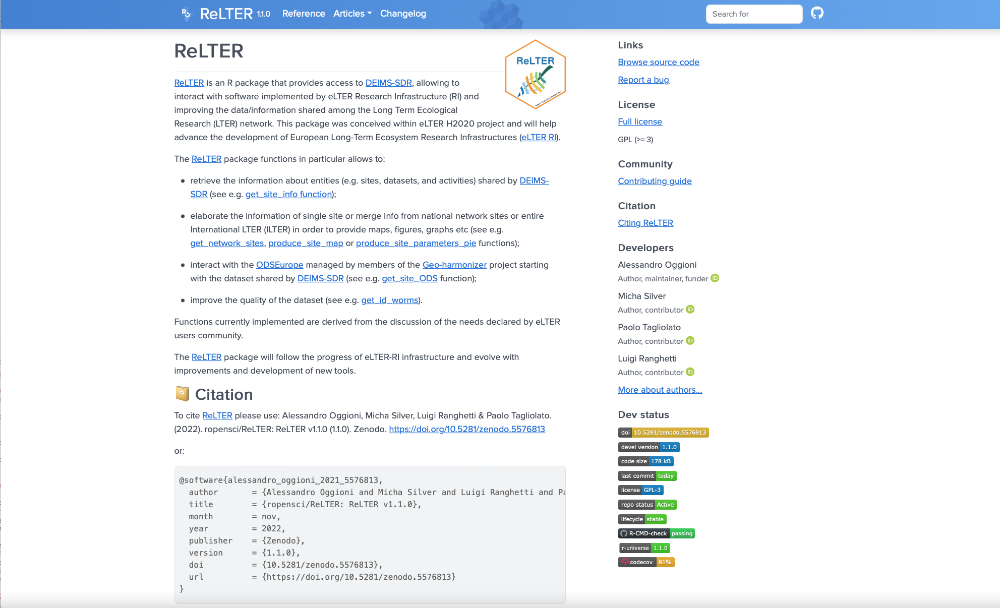
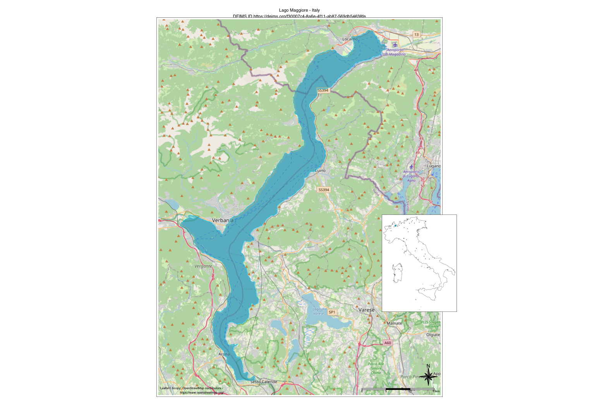
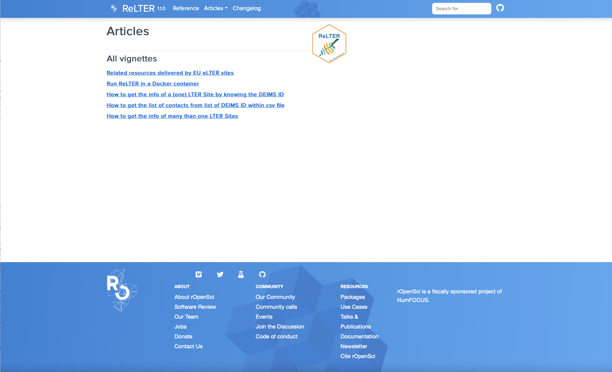

```{r relter-setup, include=FALSE, purl=FALSE}
knitr::opts_chunk$set(echo = TRUE)
```

## What is `ReLTER`

`ReLTER` is an R package that: **provides access to [DEIMS-SDR](https://deims.org/)**, allows **interact** with software implemented by eLTER Research Infrastructure (RI) and **improves the data/information shared** by them.

`ReLTER` **is born within eLTER-Plus H2020 project** and it shall definitely follow the progress of ([eLTER RI](https://elter-ri.eu/)).

`ReLTER` passed the peer review of [ROpenSci](https://ropensci.org/packages/all/), the biggest R community for open tools and open science.

{.cover height="180"}

<!-- {.cover height="375"} -->

```{r relter-loading, message=FALSE, warning=FALSE, results='hide'}
# Convenient way to load list of packages
pkg_list <- c("sf", "terra", "ReLTER", "tmap")
lapply(pkg_list,require, character.only = TRUE)
tmap_options(check.and.fix = TRUE)
tmap_mode("view")
```

----

## How to pronounce `ReLTER`

<font size="8">riːˈɛl-tiː-iː-ɑː</font>

```{r setup, include = FALSE}
html_tag_audio <- function(file, type = c("wav")) {
  type <- match.arg(type)
  htmltools::tags$audio(
    controls = "",
    htmltools::tags$source(
      src = file,
      type = glue::glue("audio/{type}", type = type)
    )
  )
}
```

#### Audio

`r html_tag_audio("sounds/ReLTER.wav")`

## How to cite `ReLTER`

```{r relter-citation, message=FALSE, results='hide'}
citation("ReLTER")

## To cite the 'ReLTER' package in publications use:
##
##   Alessandro Oggioni, Micha Silver, Luigi Ranghetti & Paolo Tagliolato.
##   (2021). oggioniale/ReLTER: ReLTER v1.1.0 (1.1.0). Zenodo.
##   https://doi.org/10.5281/zenodo.5576813
##
## A BibTeX entry for LaTeX users is
##
##   @software{alessandro_oggioni_2021_5576813,
##   author       = {Alessandro Oggioni and Micha Silver and
##                   Luigi Ranghetti and Paolo Tagliolato},
##   title        = {ropensci/ReLTER: ReLTER v1.1.0},
##   year         = 2022,
##   publisher    = {Zenodo},
##   version      = {1.1.0},
##   doi          = {10.5281/zenodo.5576813},
##   url          = {https://doi.org/10.5281/zenodo.5576813}
## }
```

----

## Basic functions of `ReLTER`

```{r relter-functions}
ls("package:ReLTER")
```

----

## Documentation of `ReLTER`

Visit the `ReLTER` website at
[docs.ropensci.org/ReLTER/](https://docs.ropensci.org/ReLTER/) for
further documentation, examples, and installation of the package.

{.cover height="375"}

The manual of `ReLTER` package could be found
[here](https://ropensci.r-universe.dev/manual/ReLTER.pdf).

----

## Examples: Search for DEIMS ID for a particular site (1/5)

The function `get_ilter_generalinfo()` allows to search by country name and site name.

Then `get_site_info()` obtains various metadata about a chosen site.

#### For this example, the Doñana LTSER Platform in Spain

```{r relter-donana}
donana <- ReLTER::get_ilter_generalinfo(country_name = "Spain",
                              site_name = "Doñana")
donana_id = donana$uri
```

----

Plot a basic map of that site. We use the `tmap` package for viewing maps.

```{r relter-plot-donana}
donana_polygon <- ReLTER::get_site_info(donana_id, category = "Boundaries")
tm_basemap("OpenStreetMap.Mapnik") +
  tm_shape(donana_polygon) +
  tm_fill(col = "blue", alpha = 0.3)
```

----

## Example: Retrieve metadata about a site (2/5)

This example retrieves metadata from Lock Kinord in Scotland.

```{r relter-kinord-info}
loch_kinord <- ReLTER::get_ilter_generalinfo(country_name = "United K",
                              site_name = "Loch Kinord")
(loch_kinord_id = loch_kinord$uri)
loch_kinord_details <- ReLTER::get_site_info(loch_kinord_id,
                                 c("Contacts", "EnvCharacts", "Parameters"))

print(paste("Site manager:",
            loch_kinord_details$generalInfo.siteManager[[1]]['name'],
            loch_kinord_details$generalInfo.siteManager[[1]]['email']))
```

----

```{r relter-kinord-metadata}
# Metadata contact:
(loch_kinord_details$generalInfo.metadataProvider[[1]]['name'])
print(paste("Average air temperature:",
            loch_kinord_details$envCharacteristics.airTemperature.avg))
print(paste("Annual precipitation:",
            loch_kinord_details$envCharacteristics.precipitation.annual))
```

----

```{r relter-kinord-geobonbiome}
print(paste("GeoBonBiome:",
            loch_kinord_details$envCharacteristics.geoBonBiome[[1]]))
# Parameters:
head(loch_kinord_details$parameter[[1]]['parameterLabel'], 12)
```

----

## Example: Query a network (3/5)

The LTER network in Slovakia

```{r elter-slovakia}
lter_slovakia_id = "https://deims.org/networks/3d6a8d72-9f86-4082-ad56-a361b4cdc8a0"
network_research_topics <- get_network_research_topics(lter_slovakia_id)
```

The list of research topics collected by Slovakia LTER network are:

```{r elter-slovakia1}
head(network_research_topics$researchTopicsLabel, 20)
```

----

```{r relter-slovakia-network}
lter_slovakia_sites <- get_network_sites(lter_slovakia_id)
```

The list of the sites in Slovakia LTER network are:

```{r relter-slovakia-network1}
lter_slovakia_sites$title
```

----

#### Show map of sites in the network

```{r relter-slovakia-map}
lter_slovakia <- produce_network_points_map(lter_slovakia_id, "SVK")
svk <- readRDS("gadm36_SVK_0_sp.rds")  # downloaded by produce_network_points_map()
tm_basemap("OpenStreetMap.Mapnik") +
  tm_shape(lter_slovakia) +
  tm_dots(col = "blue", size=0.04) +
  tm_shape(svk) +
  tm_borders(col = "purple", lwd = 0.6) +
  tm_grid(alpha = 0.4) +
  tm_scale_bar(position = c("right", "bottom"))
```

----

## Example: Related resources (4/5)

The `get_site_info` function provides a list of related resources (e.g. datasets) shared by a site (e.g. Lake Maggiore)

```{r retated_resources}
tSiteRelatedResources <- ReLTER::get_site_info(
  deimsid = "https://deims.org/f30007c4-8a6e-4f11-ab87-569db54638fe",
  category = "RelateRes"
)
print(tSiteRelatedResources$relatedResources[[1]][c(2:5),])
```

----

## Example: map object of a site (5/5)

The `produce_site_map` function produces a map of the site boundaries, within a given country and network.

```{r site_map, warning=FALSE, message=FALSE, results='hide'}
tmap::tmap_mode("plot")
# Example of Lake Maggiore site
sitesNetwork <- ReLTER::get_network_sites(
  networkDEIMSID = "https://deims.org/network/7fef6b73-e5cb-4cd2-b438-ed32eb1504b3"
)
# In the case of Italian sites are selected only true sites and excluded the
# macrosites.
sitesNetwork <- (sitesNetwork[!grepl('^IT', sitesNetwork$title),])
sf::st_crs(sitesNetwork) = 4326
siteMap <- ReLTER::produce_site_map(
  deimsid = "https://deims.org/f30007c4-8a6e-4f11-ab87-569db54638fe",
  countryCode = "ITA",
  listOfSites = sitesNetwork,
  gridNx = 0.7,
  gridNy = 0.35
)
```

{.cover height="500"}
----

## Other examples

Some other examples can be found in the articles of `ReLTER` documentation.

https://docs.ropensci.org/ReLTER/articles/

{.cover height="375"}