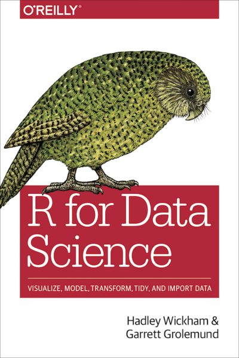
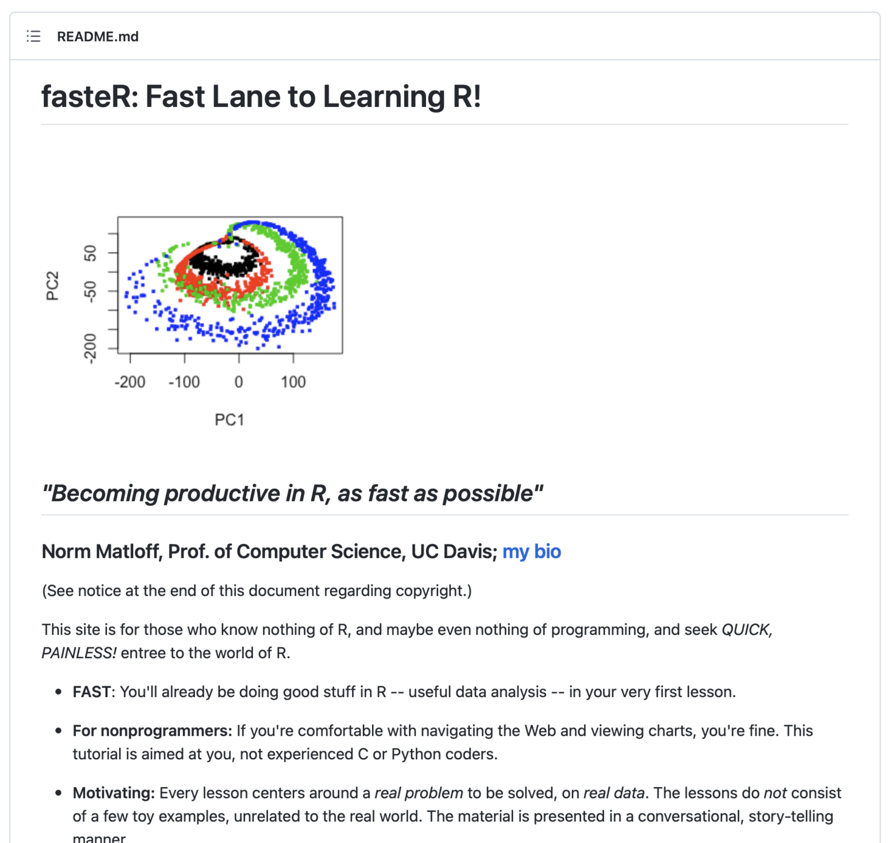
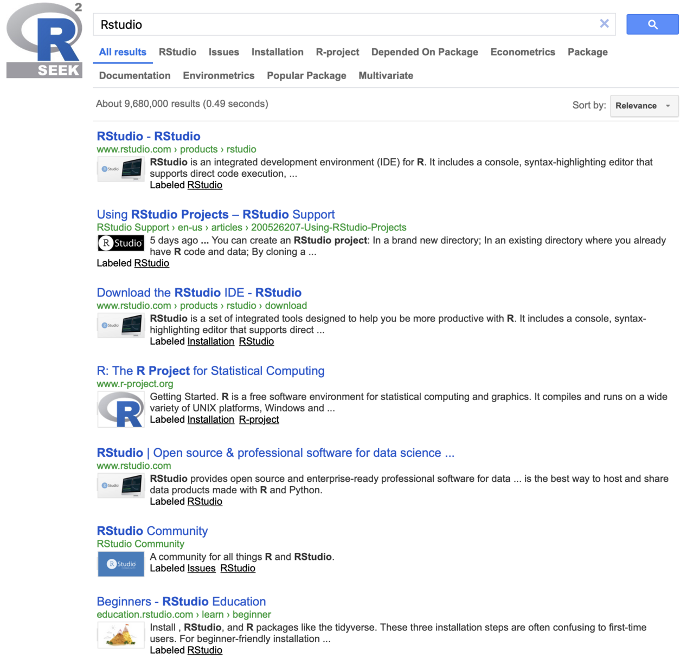
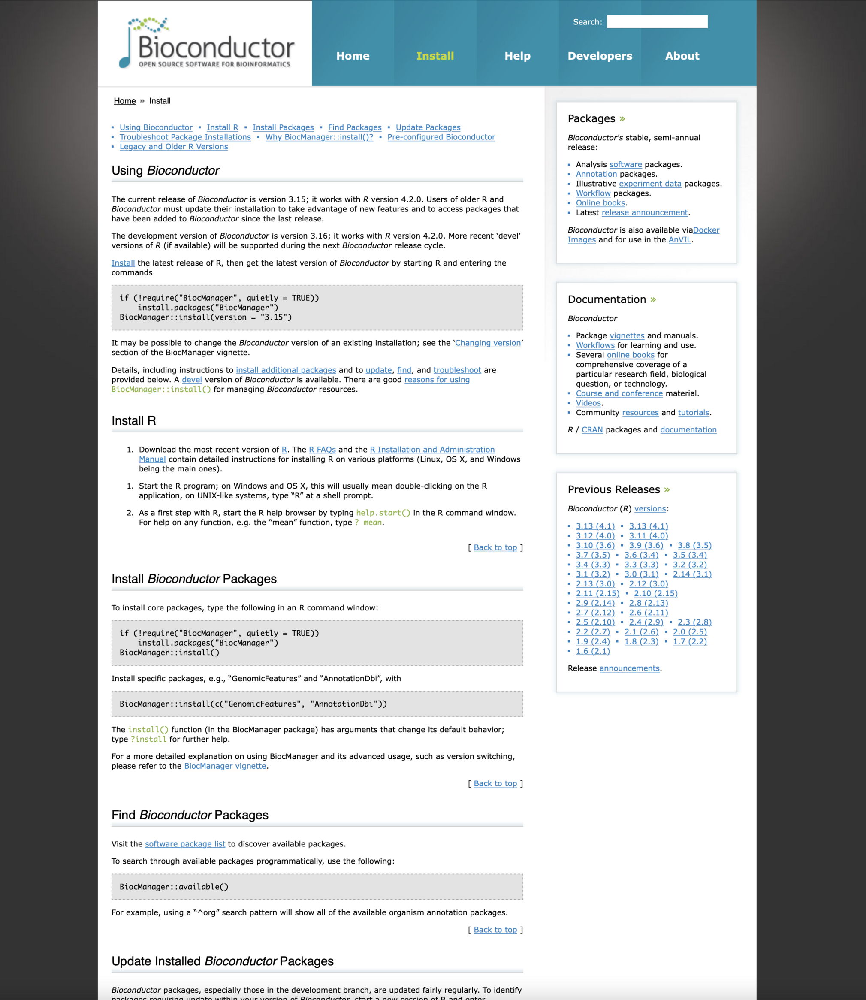
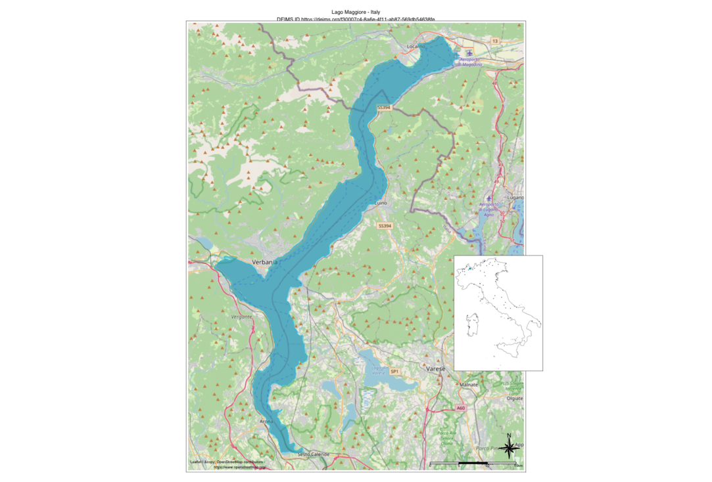

```{r setup1, include=FALSE, purl=FALSE}
knitr::opts_chunk$set(echo = TRUE)
# Convenient way to load list of packages
pkg_list <- c("sf", "terra", "ReLTER", "tmap", "knitr", "glue", "dplyr")
lapply(pkg_list, require, character.only = TRUE)
tmap_options(check.and.fix = TRUE)
tmap_mode("view")
```
## Session SE18

living document:

https://docs.google.com/document/d/1omDa3lDHnNP23T0amVv_oeEuBL7Hl73e/edit#heading=h.gjdgxs

<iframe src="https://docs.google.com/document/d/1omDa3lDHnNP23T0amVv_oeEuBL7Hl73e/edit#heading=h.gjdgxs" scrolling= "yes"></iframe>

## Some `R` online resources
 
 - `R` for Data Science: https://r4ds.had.co.nz
 - FasteR: https://github.com/matloff/fasteR
 - Rseek: https://rseek.org/
 
 {.cover width="250"}  {.cover width="250" height="375"}  {.cover width="250" height="375"}

## Where to get `R` packages
 
 - CRAN: https://cran.r-project.org/
 - BioConductor: https://www.bioconductor.org/install/
 - GitHub packages repository (i.e. [`ReLTER`](https://docs.ropensci.org/ReLTER/index.html), [`lterdatasampler`](https://lter.github.io/lterdatasampler/), [`EML`](https://docs.ropensci.org/EML/) )
 - ROpenSci: https://ropensci.org
 
 {.cover height="375"}        {.cover height="375"}
 
## This Demo

  - Rmarkdown: cloned from https://github.com/micha-silver/ReLTER_demo
  - Slides on website: https://micha-silver.github.io/index.html
  
  {.cover height="600"}

## Beginning with RStudio and git

  RStudio (https://www.rstudio.com/products/rstudio/download/)

#### Start a new RStudio project **based on a git repo**.

New Project -> Version Control

{.cover width="350"}

Encourages collaboration "out of the box". https://github.com/micha-silver/ReLTER_demo

## Some demo requirements

*Please execute the code before continue the presentation*

```{r intro-packages, message=FALSE}
# Install some standard spatial packages from CRAN
if (!require("sf", quietly = TRUE))
  install.packages("sf")
if (!require("terra", quietly = TRUE))
  install.packages("terra")
if (!require("knitr", quietly = TRUE))
  install.packages("knitr")
if (!require("glue", quietly = TRUE))
  install.packages("glue")
if (!require("remotes", quietly = TRUE))
  install.packages("remotes")

# package from Bioconductor
if (!require("BiocManager", quietly = TRUE))
  install.packages("BiocManager")
BiocManager::install()
BiocManager::install("EBImage")
```

## `ReLTER` installation

```{r install-ReLTER, message=FALSE}
# Install the dev version of ReLTER for use new function
if (!require("ReLTER", quietly = TRUE))
  remotes::install_github("ropensci/ReLTER", force = TRUE)

## ReLTER is specially drafted for the LTER community.
## 
## To contribute to the improvement of this package, join the group of
##     developers (https://github.com/ropensci/ReLTER).
## 
## If you use this package, please cite as:
## 
## Alessandro Oggioni, Micha Silver, Luigi Ranghetti & Paolo Tagliolato.
##     (2021) oggioniale/ReLTER: ReLTER v1.1.0 (1.1.0). Zenodo.
##     https://doi.org/10.5281/zenodo.5576813
```

or you can [run `ReLTER` in a Docker container](SE18_majorcaMeeting_ReLTER.html#63)

## Documentation of `ReLTER`

Visit the `ReLTER` website at
[docs.ropensci.org/ReLTER/](https://docs.ropensci.org/ReLTER/) for
further documentation, examples, and installation of the package.

<iframe src="https://docs.ropensci.org/ReLTER/" scrolling= "yes"></iframe>

## Loading packages

After installing, we need to load the packages into this `R` session.

```{r intro-loading, message=FALSE, warning=FALSE}
# Convenient way to load list of packages
pkg_list <- c("sf", "terra", "ReLTER", "tmap", "knitr", "glue")
lapply(pkg_list, require, character.only = TRUE)
```

## `R` Spatial

#### Key packages

  - Handling vector data: `sf`, `terra`
  - Handling raster data: `terra`, `stars`
  - Visualization: `tmap`, `leaflet`, `ggmap`, `ggplot`

#### Online resources

  - Geocomputation with R: https://geocompr.robinlovelace.net/
  - Spatial Data Science: https://www.rspatial.org/
  - A blog on R-spatial issues: https://r-spatial.org/
  - Packages are maintained here: https://github.com/rspatial

## Start with the ReLTER examples

* [Basic functions](SE18_majorcaMeeting_ReLTER.html#12)

* [Plotting functions](SE18_majorcaMeeting_ReLTER.html#27)

* [Interaction with third-party data](SE18_majorcaMeeting_ReLTER.html#34)

* [Chaining of several functions](SE18_majorcaMeeting_ReLTER.html#49)

# Basic functions

## Information from site

*`ReLTER` relies on the data entered into DEIMS-SDR.*

----

#### Lake Maggiore

```{r site_info}
lakeMaggiore <- ReLTER::get_site_info(
  deimsid = "https://deims.org/f30007c4-8a6e-4f11-ab87-569db54638fe",
  category = "Boundaries"
)
lakeMaggiore
```

----

```{r lakeMaggioreMap}
leaflet::leaflet(lakeMaggiore) %>%
  leaflet::addProviderTiles(provider = "CartoDB.PositronNoLabels",
                            group = "Basemap",
                            layerId = 123) %>%
  leaflet::addTiles("http://{s}.basemaps.cartocdn.com/light_only_labels/{z}/{x}/{y}.png") %>% 
  leaflet::addPolygons(color = "#444444", weight = 1, smoothFactor = 0.5,
    opacity = 1.0, fillOpacity = 0.5)
```

----

#### Which kind of categories?

Following the [specification of DEIMS-SDR](https://deims.org/models/?id=site) for each site you can get:

* Affiliations

* Boundaries

* Contacts

* EnvCharacts

* General

* Infrastructure

* Parameters

* RelateRes

* ResearchTop

----

#### not only map

```{r lakeMaggioreOtherInfo}
siteInfo <- ReLTER::get_site_info(
  deimsid = "https://deims.org/f30007c4-8a6e-4f11-ab87-569db54638fe",
  category = c("Affiliations")
)
knitr::kable(siteInfo$affiliation.projects[[1]])
```

## Get info from Activity and ...

#### Mar Piccolo di Taranto

Without map

```{r activityMarPiccolo}
activityNoMap <- ReLTER::get_activity_info(
  activityid =
  "https://deims.org/activity/8786fc6d-5d70-495c-b901-42f480182845",
  show_map = FALSE
)
activityNoMap
```

----

with map

```{r activityMarPiccoloMap}
activityMap <- ReLTER::get_activity_info(
  activityid =
  "https://deims.org/activity/8786fc6d-5d70-495c-b901-42f480182845",
  show_map = TRUE
)
```

<iframe src="./other/activityMap.html" height="360" width="650" style="border: 1px solid #464646;"></iframe>

## ... and Dataset

The Map of dataset provided by Lake Maggiore

```{r dataset}
tDataset <- get_dataset_info(
  datasetid = "https://deims.org/dataset/38d604ef-decb-4d67-8ac3-cc843d10d3ef",
  show_map = TRUE
)
```

<iframe src="./other/datasetMap.html" height="360" width="650" style="border: 1px solid #464646;"></iframe>

----

The table about dataset information

```{r datasetTable}
tDataset
```

## Missing information on DEIMS-SDR

However sometimes there are:

 - Multiple sites with similar names
 - Missing information
 - Sites with no boundary polygon
 
#### First example, the Kiskun region of Hungary

Query for Site Manager

```{r adv-missing}
# Multiple sites in the KISKUN region of Hungary
kiskun <- ReLTER::get_ilter_generalinfo(country_name = "Hungary",
                              site_name = "KISKUN")
# How many sites?
print(paste("In Kiskun region: ", length(kiskun$title), "sites"))
```

----

```{r adv-missing2}
(kiskun$title)
# Which site? Bugac-Bocsa
bugac_id <- kiskun[7,]$uri
bugac_details <- ReLTER::get_site_info(bugac_id,"Contacts")
(bugac_details$generalInfo.siteManager[[1]]['name'])
```

----

Now query for boundary

```{r adv-missing-boundary}
bugac_polygon <- ReLTER::get_site_info(bugac_id, "Boundaries")
str(bugac_polygon)
# No geometry
```

 - This site has the site manager's name
 - but no boundary polygon
 
----

#### Second example, Gran Paradiso in Italy

```{r adv-paradiso}
paradiso <- ReLTER::get_ilter_generalinfo(country_name = "Italy",
                              site_name = "Gran Paradiso")
(paradiso$title)

# Choose the second
paradiso_id <- paradiso[2,]$uri
paradiso_details <- ReLTER::get_site_info(paradiso_id, "Contacts")
# Multiple names for metadata:
paradiso_details$generalInfo.metadataProvider[[1]]['name']
```

----

```{r adv-paradiso-info}
# But what about funding agency
paradiso_details$generalInfo.fundingAgency
```

 - This site has metadata providers
 - but no funding agency

# Plotting functions

## Additional plotting functions

#### Environmental parameters

`ReLTER` has implemented some revealing visualizations of the various parameters collected at LTER sites. One visualization is the pie chart of environmental parameters.

----

In an example above the DEIMS ID of Kis Balaton (Kiskun LTER) was found. We'll use that site to show a pie chart of environmental variables collected in that site.

```{r adv-pie-params, warning=FALSE, message=FALSE}
ReLTER::produce_site_parameters_pie("https://deims.org/8129fed1-37b3-48e6-b786-d416917acc72")
```

----

Similarly, a "waffle" chart can be produced.

```{r adv-waffle-params, warning=FALSE, message=FALSE}
ReLTER::produce_site_parameters_waffle("https://deims.org/8129fed1-37b3-48e6-b786-d416917acc72")
```

----

#### Map object of a site

The `produce_site_map` function produces a map of the site boundaries, within a given country and network.

```{r relter-site_map, warning=FALSE, message=FALSE}
tmap::tmap_mode("plot")
# Example of Lake Maggiore site
sitesNetwork <- ReLTER::get_network_sites(
  networkDEIMSID = "https://deims.org/network/7fef6b73-e5cb-4cd2-b438-ed32eb1504b3"
)
# In the case of Italian sites are selected only true sites and excluded the
# macrosites.
sitesNetwork <- (sitesNetwork[!grepl('^IT', sitesNetwork$title),])
sf::st_crs(sitesNetwork) = 4326
siteMap <- ReLTER::produce_site_map(
  deimsid = "https://deims.org/f30007c4-8a6e-4f11-ab87-569db54638fe",
  countryCode = "ITA",
  listOfSites = sitesNetwork,
  gridNx = 0.7,
  gridNy = 0.35
)
```

----

{.cover height="600"}

----

#### QR Code

The `produce_site_qrcode` function produces a QRCode of the site (or Activity, Dataset, Network, etc.)

*Lake Maggiore*
{.cover height="600"}

# Interaction with third-party data

## Some requirements for these fuctions

*before continue please execute install development version of ReLTER Package*

```{r devReLTER}
if (!require("ReLTER", quietly = TRUE))
  remotes::install_github("ropensci/ReLTER", ref = 'dev__withImprovements', force = TRUE)
```

## Acquiring Earth Observation data

Functions within `ReLTER` help to acquire certain Earth Observation datasets.

The `get_site_ODS()` function offers to `ReLTER` users access to the OpenDataScience Europe (ODS) archive (https://maps.opendatascience.eu/) with landcover, NDVI, natura2000, Corine landcover, and OSM features, all at 30 meter pixel resolution. Cropping to site boundaries is done in the cloud, and due to the Cloud Optimized Geotiff (COG) format, downloads are quite small. 

----

#### First example, Kis-Balaton site in Kiskun region, Hungary

```{r adv-balaton-ods}
# Get DEIMS ID for Kis-Balaton site 
kis_balaton <- ReLTER::get_ilter_generalinfo(country_name = "Hungary",
                              site_name = "Kis-Balaton")
kb_id = kis_balaton$uri
kb_polygon = ReLTER::get_site_info(kb_id, "Boundaries")

# Now acquire landcover and NDVI from ODS
kb_landcover = ReLTER::get_site_ODS(kb_id, dataset = "landcover")
kb_ndvi_summer = ReLTER::get_site_ODS(kb_id, "ndvi_summer")
```

----

```{r adv-balaton-plot}
# Plot maps
tm_basemap("OpenStreetMap.Mapnik") + 
  tm_shape(kb_polygon) +
  tm_borders(col = "purple") + 
  tm_shape(kb_ndvi_summer) +
  tm_raster(alpha=0.7, palette = "RdYlGn")
```

----
 
```{r adv-balaton-plot2}
tm_basemap("OpenStreetMap.Mapnik") + 
  tm_shape(kb_polygon) +
  tm_borders(col = "purple") + 
  tm_shape(kb_landcover) +
  tm_raster(alpha=0.7, palette = "Set1")
```

----

#### Second example, Companhia das Lezírias, Portugal

```{r adv-companhia}
lezirias <- ReLTER::get_ilter_generalinfo(country_name = "Portugal",
                              site_name = "Companhia")
lezirias_id = lezirias$uri
lezirias_polygon = ReLTER::get_site_info(lezirias_id, "Boundaries")

# Now acquire spring NDVI from OSD
lezirias_ndvi_spring = ReLTER::get_site_ODS(lezirias_id, "ndvi_spring")
```

----

```{r adv-companhia-plot}
# Plot maps
tmap::tm_basemap("OpenStreetMap.Mapnik") + 
  tmap::tm_shape(lezirias_polygon) +
  tmap::tm_borders(col = "purple") + 
  tmap::tm_shape(lezirias_ndvi_spring) +
  tmap::tm_raster(alpha=0.7, palette = "RdYlGn")
```

----

The function outputs a raster. We can save to Geotiff for use in other GIS

```{r adv-save}
class(lezirias_ndvi_spring)
terra::writeRaster(x = lezirias_ndvi_spring,
            filename = "lezirias_ndvi_spring.tif",
            overwrite = TRUE)
```

*The "lezirias_ndvi_spring.tif" file has been created.*

----

#### Research topics, Related resources

List all research topics throughout an LTER network.

List related resources for an LTER network.

We demonstrate with the LTER network in Slovakia. Then filter for "Ecosystem" research.

```{r research-topics}
lter_slovakia_id <- "https://deims.org/networks/3d6a8d72-9f86-4082-ad56-a361b4cdc8a0"
slv_research_topics <- ReLTER::get_network_research_topics(lter_slovakia_id)
ecosystem_items <- grepl(pattern = "ecosystem",
                         slv_research_topics$researchTopicsLabel,
                         fixed = TRUE)
# Here is the filtered list
knitr::kable(slv_research_topics[ecosystem_items,])
```

----

#### List related resources
```{r related-resources}
knitr::kable(get_network_related_resources(lter_slovakia_id))
```

## Acquiring biodiversity data

Functions within `ReLTER` help to acquire certain third parties biodiversity datasets. The `get_site_speciesOccurrences` function^1^, offers to `ReLTER` users access to the occurrence records from [GBIF](https://www.gbif.org) (via [`rgbif` R package](https://docs.ropensci.org/rgbif/)), [iNaturalist](https://www.inaturalist.org/) and [OBIS](https://obis.org/) carried out within the boundaries of the site.

Coauthor of these functions are Martina Zilioli and Paolo Tagliolato.

<font size="2">^1^ `get_site_speciesOccurrences`, `map_occ_gbif2elter` and `save_occ_eLTER_reporting_Archive` currently are delivered only with dev__withImprovements branch of `ReLTER`</font> 

----

#### First example, the Gulf Of Venice (GOV)

```{r adv-GOF, warning=FALSE, message=FALSE, eval=FALSE}
# DEIMS.iD of eLTER site Gulf Of Venice (GOV)
GOVid <- "https://deims.org/758087d7-231f-4f07-bd7e-6922e0c283fd"
resGOV <- ReLTER::get_site_speciesOccurrences(
  deimsid = GOVid, list_DS = "obis", show_map = TRUE, limit = 10)
```

<iframe src="./other/occurrences_GOV.html" height="360" width="650" style="border: 1px solid #464646;"></iframe>

----

#### Second example, the Saldur River Catchment

```{r Saldur, warning=FALSE, message=FALSE, eval=FALSE}
# DEIMS.iD of eLTER the Saldur River Catchment site 
saldur_id <- "https://deims.org/97ff6180-e5d1-45f2-a559-8a7872eb26b1"
occ_SRC <- ReLTER::get_site_speciesOccurrences(
  deimsid = saldur_id, list_DS = c("gbif", "inat"), show_map = TRUE, limit = 100)
```

<iframe src="./other/occurrences_saldur.html" height="360" width="650" style="border: 1px solid #464646;"></iframe>

----

#### Trasform this data into eLTER data template

Fields mapping among the three data source schemas (i.e., GBIF, iNaturalist, OBIS) and the eLTER data-reporting template (Peterseil et al., 2021) was carried out so as to design `ReLTER` functions: `map_occ_gbif2elter` and `save_occ_eLTER_reporting_Archive`.

Below an example of iNaturalist export data, for the Saldur River Catchment site.


```{r export, warning=FALSE, message=FALSE, eval=FALSE}
library(dplyr)
saldurid <- "https://deims.org/97ff6180-e5d1-45f2-a559-8a7872eb26b1"
resSaldur <- ReLTER::get_site_speciesOccurrences(
  deimsid = saldurid, list_DS = c("gbif", "inat"), show_map = FALSE, limit = 20,
  exclude_inat_from_gbif = TRUE)
# iNaturalist
tblSaldur_inat <- tibble::as_tibble(resSaldur$inat)
outInat <- tblSaldur_inat %>%
  ReLTER::map_occ_inat2elter(deimsid = saldurid)
ReLTER::save_occ_eLTER_reporting_Archive(outInat)
```

The eLTER useful archive created is:

* biodiv_occurrence_site_97ff6180-e5d1-45f2-a559-8a7872eb26b1_inat.zip

# Show a chaining of several functions

## Please return to the main version of package

*Before continue please execute install the last version of ReLTER Package*

```{r ReLTER}
if (!require("ReLTER", quietly = TRUE))
  remotes::install_github("ropensci/ReLTER", force = TRUE)
if (!require("dplyr", quietly = TRUE))
  install.packages("dplyr")
library(ReLTER)
library(dplyr)
```

## LTER Network

This example uses the LTER network in Greece. Call the `produce_network_points_map()` function (requires both DEIMS network ID and the three letter ISO code for the country to be mapped) to get all sites in a country.

```{r adv-greece-network}
tmap::tmap_mode("view")
lter_greece_id = "https://deims.org/networks/83453a6c-792d-4549-9dbb-c17ced2e0cc3"
lter_greece <- ReLTER::produce_network_points_map(networkDEIMSID = lter_greece_id, countryCode = "GRC")
```

----

```{r adv-greece-plot}
grc <- readRDS("gadm36_GRC_0_sp.rds")  # available from `produce_network_points_map()

tmap::tm_shape(grc) +
  tmap::tm_borders(col = "purple", lwd = 2) +
  tmap::tm_grid(alpha = 0.4) +
  lter_greece
```

## Get general information of the network’s sites

```{r networkGenInfo}
listItaSites <- ReLTER::get_network_sites(
 networkDEIMSID =
   "https://deims.org/network/7fef6b73-e5cb-4cd2-b438-ed32eb1504b3"
) %>%
  dplyr::filter(!grepl('^IT', title))
```

----

```{r tableList}
knitr::kable(
  listItaSites[1:10, ],
  caption = "The list of site for LTER-Italy network"
)
```

----

#### Contact list of all lake site managers

```{r networkMap}
sites <- as_tibble(
  listItaSites
) %>%
  filter(grepl("Lago", title)) %>%
  filter(!row_number() %in% c(1, 21, 22))

allSiteContact <- lapply(as.list(sites$uri),
    ReLTER::get_site_info, category = "Contacts"
  )
contacts <- tibble::tibble(
  siteName = NA,
  managerName = NA,
  managerEmail = NA,
  managerORCID = NA
)
for (i in seq_len(length(allSiteContact))) {
  contacts <- contacts %>% 
    tibble::add_row(
      siteName = allSiteContact[[i]]$title,
      managerName = allSiteContact[[i]]$generalInfo.siteManager[[1]]$name,
      managerEmail = allSiteContact[[i]]$generalInfo.siteManager[[1]]$email,
      managerORCID = allSiteContact[[i]]$generalInfo.siteManager[[1]]$orcid
    )
}
```

----

```{r tableContacts}
# Contacts table
knitr::kable(
  contacts,
  caption = "List of the contacts"
)
```


## Get all resources delivered by EU eLTER sites

*Some other required package*
```{r requirements1}
if (!require("purrr", quietly = TRUE))
  install.packages("purrr")

library(purrr)
```

----

#### Resources delivered

```{r allResources}
eLTER_eu_networks <- readr::read_csv("./other/eLTER_eu_networks.csv", show_col_types = FALSE) %>%
  tibble::as_tibble()

related_resources <- purrr::map_dfr(
  as.list(
    eLTER_eu_networks$DEIMS.iD
  ),
  function (x) {
    ReLTER::get_network_related_resources(x) %>%
      dplyr::filter(!is.na(uri)) %>%
      dplyr::mutate(
        networkID = x,
        type = stringr::str_replace(uri, "https://deims.org/(.*)/.*","\\1")
      )
  }
) %>%
  dplyr::inner_join(eLTER_eu_networks, by = c("networkID" = "DEIMS.iD")) %>%
  dplyr::select(
    title = relatedResourcesTitle,
    uri,
    lastChanged = relatedResourcesChanged,
    networkID,
    type,
    network = eLTER_EU_Networks,
    country
  )
```

----

```{r tableResources}
tbl_resources <- related_resources %>%
  dplyr::count(country, type) %>%
  tidyr::pivot_wider(names_from = type, values_from = n, values_fill = 0)

knitr::kable(
  tbl_resources,
  caption = "eLTER EU networks related resources"
)
```


----

#### Map of dataset delivered

*Some other required packages*
```{r requirements2}
library(rnaturalearth)
library(rworldmap)
library(ggplot2)
```

----

#### Dataset distribution map

```{r resourcesMap}
# Get the world map
worldMap <- rworldmap::getMap()

world_map <- rnaturalearth::ne_countries(scale = 50, returnclass = 'sf')
europe_map <- world_map %>%
  filter(name %in% related_resources$country)

elter_map <- europe_map %>%
  dplyr::select(
    name,
    geometry
  ) %>%
  dplyr::left_join(tbl_resources, by = c("name" = "country"))

map_datasets <- ggplot2::ggplot() +
  ggplot2::geom_sf(data = elter_map, ggplot2::aes(fill = dataset)) +
  ggplot2::coord_sf(xlim = c(-20, 45), ylim = c(28, 73), expand = FALSE)
```

----

```{r mapDatasets}
map_datasets
```

# Run `ReLTER` i a docker container

## Rocker ReLTER

A Docker image for [ReLTER](https://github.com/ropensci/ReLTER) package.

#### Capabilities

Run RStudio with preinstalled ReLTER package through Docker.

----

#### Quick setup
  1. Follow the instructions to
[install Docker on your computer](https://docs.docker.com/get-docker/).
  1. Open a terminal ("command prompt" in Windows) and write the following command to download the
[rocker_relter](https://hub.docker.com/r/ptagliolato/rocker_relter) image

```{bash docker1, eval=FALSE}
docker pull ptagliolato/rocker_relter
```
  1. Run the image:

```{bash docker2, eval=FALSE}
docker run -e PASSWORD=yourpassword -p 8080:8787 \
  ptagliolato/rocker_relter
```

    * This will run RStudio on port 8080, you can change the port as you like.
    * You can change "yourpassword" with the password you prefer.
    * If you close the terminal, the image will stop. To avoid this, add "-d" before "-e"
    to run "detached" from the terminal.
    * See further options in the last section.

####  Open your browser at [localhost:8080](localhost:8080) and login with

      user: rstudio
      password: yourpassword

----

#### Run experimental features of ReLTER package

ReLTER package is evolving. You can run some of the features recently
added to the package (namely those presented in eLTER Plus deliverable D.4.1
to retrieve and manage biodiversity data from GBIF, OBIS and iNaturalist) by using
the alternative image "dev__withImprovements":

```{bash docker3, eval=FALSE}
docker pull ptagliolato/rocker_relter:dev__withImprovements

docker run -e PASSWORD=yourpassword -p 8080:8787 \
  ptagliolato/rocker_relter:dev__withImprovements
```


#### Preserve your work (use a docker volume)

When you stop a docker container, the files created within it are lost. In order to preserve your work across
different runs, link a local volume (in this example, the current working directory, $(pwd)) to the container:

```{bash docker4, eval=FALSE}
docker run -d -v $(pwd):/home/rstudio -e PASSWORD=yourpassword \
  -p 8080:8787 ptagliolato/rocker_relter
```

# Final remarks

## How to collaborate with `ReLTER`

<iframe src="https://docs.ropensci.org/ReLTER/CONTRIBUTING.html" scrolling= "yes"></iframe>